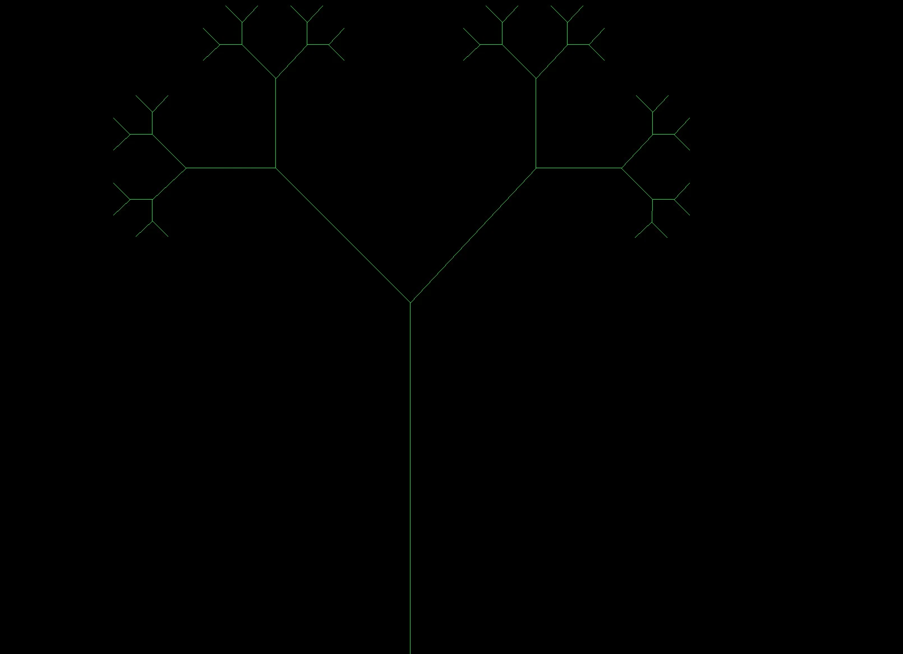

# L-Systems

## Description

[L-Systems](https://en.wikipedia.org/wiki/L-system) are a type of grammar
that recursively expands to larger expressions which often encode some fractal-like structure.
To display this generated L-System, the project uses a very simple
implementation of a [turtle graphics](https://en.wikipedia.org/wiki/Turtle_graphics).



## Building the Project

The project depends upon the [raylib](https://github.com/raysan5/raylib). The build script [build.sh](build.sh)
should take care of cloning this library. Afterwards, you can run the script [run.sh](run.sh) to compile and exec the
final binary.

## Making An L-System

L-Systems include of form of grammar that describes how the characters/tokens inside the
langauge are transfomred to a larger series of tokens (e.g. 1 => 11). For example, the L-System
for a binary tree looks like this:

```
vars : 0, 1
axiom : 0
rules : (1 = 11), (0 = 1[0]0)
```

To implement your own L-System, you need to include declarations that will
form the L-System.

Here are the parts of the L-System you must implement:

- **Rules**: Creates the grammar of the L-System. Here, you must provide rules about how each token
  can be transformed into another sequence of tokens. (**NOTE**: every token must have a rule, even if it just
  consists of an identity [ => [).
- **Axiom**: The base token that will be recursively expanded by applying the rules.
- **Codec**: Actions the turtle (drawer) must preform for each token encountered in the input.

Using this system, the binary tree L-System can be implemented
with the following declarations inside [btree.c](src/rules/btree.c):

```c
#include "../lsystem.h"
#include "../turtle.h"
#define LEFT 45
#define RIGHT -45
// BTREE CODEC FUNCTIONS
// 0 token codec - draw line segment (should be ending leaf)
static void codec1(Turtle *t)  {
  draw_lineseg(t);
}

// 1 token codec - draw line segment (should be stem)
static void codec2(Turtle *t) {
  draw_lineseg(t);
}

// [ token codec - push history, turn left (+45) degrees
static void codec3(Turtle *t) {
  History h = {.xpos = t->xpos, .ypos = t->ypos, .angle = t->angle};
  push(&t->history, h);
  t->angle += LEFT;
}

// ] token codec - pop history, turn right  (-45) degrees
void codec4(Turtle *t) {
  History h = pop(&t->history);
  reset(t, h);
  t->angle += RIGHT;
}

// BTREE LSYSTEM RULES DECLARATION
// rules
const static Rule r1 = {.input = '0', .output = "1[0]0"};
const static Rule r2 = {.input = '1', .output = "11"};
const static Rule r3 = {.input = '[', .output = "["};
const static Rule r4 = {.input = ']', .output = "]"};
const static Rule rules[] = {r1, r2, r3, r4};
const static RuleList rlist = {.rules = rules, .size = 4};

// codecs
const static Codec c1 = {.t = '0', .turtleAction = &codec1};
const static Codec c2 = {.t = '1', .turtleAction = &codec2};
const static Codec c3 = {.t = '[', .turtleAction = &codec3};
const static Codec c4 = {.t = ']', .turtleAction = &codec4};
const static Codec codecs[] = {c1, c2, c3, c4};

const static CodecList clist = {.codecs = codecs, .size = 4};
const LSystem LSYSTEM = {.axiom = '0', .rlist = rlist, .clist = clist};
```

The very last part (`const LSystem LSYSTEM = {.axiom = '0', .rlist = rlist, .clist = clist};`) is important
because this is where we finally initialize a external variable which is first declared iniside
[lsystem.h](src/lsystem.h).
